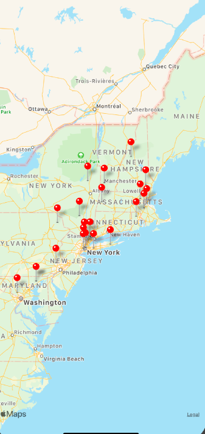

# Covid App

This app covers all reported cases along the eastern seaboard: New York, New Hampshire, Vermont, Maine, Massachusetts, Pennyslvania, Delaware, Rhode Island, Connecticut, Maryland, Maine.

We used the covid-19 API provided by lecture and the uses the react-native maps api to create the markers and the map. 

