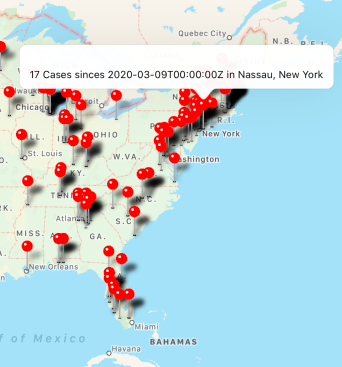

# Covid App

Before, this app covers only all the reported cases along the eastern seaboard: New York, New Hampshire, Vermont, Maine, Massachusetts, Pennyslvania, Delaware, Rhode Island, Connecticut, Maryland, Maine. (Improvement, now it covers all of the provinces). Now it can cover all of the United States provinces and cities. 

We used the covid-19 API provided by lecture and the uses the react-native maps api to create the markers and the map. Then we parse the json to retrieve the number of cases for each city from each province and provide the date from which it retrieved the information.

Below is a snapshot of the react native app, showing where all the covid-19 infections occur and the number of incidences. 

